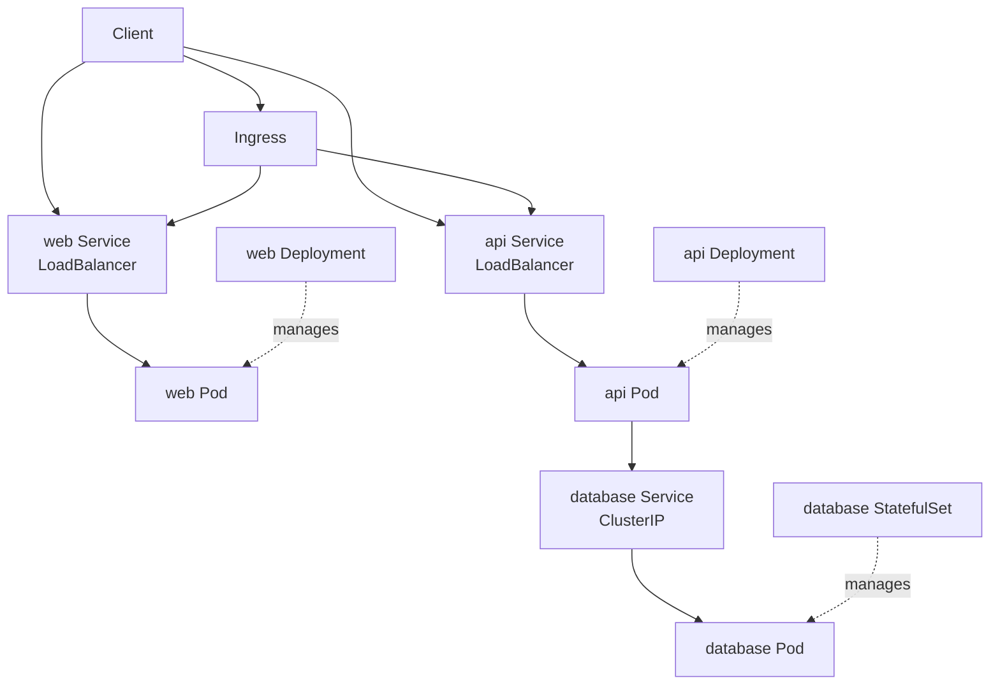

# Kubernetes manifests

API、web、database の manifest です。

## 構成



## Secret

```sh
kubectl create namespace sandbox-auth

kubectl -n sandbox-auth create secret generic sandbox-auth-database-secret \
  --from-literal=POSTGRES_DB=test \
  --from-literal=POSTGRES_USER=postgres \
  --from-literal=POSTGRES_PASSWORD='replace-me'

kubectl -n sandbox-auth create secret generic sandbox-auth-api-secret \
  --from-literal=DB_USER=postgres \
  --from-literal=DB_PASSWORD='replace-me' \
  --from-literal=GOOGLE_ID='replace-me' \
  --from-literal=GOOGLE_SECRET='replace-me' \
  --from-literal=AUTH_SECRET='replace-me-with-at-least-32-bytes'

kubectl -n sandbox-auth create secret tls sandbox-auth-tls \
  --cert=/path/to/tls.crt \
  --key=/path/to/tls.key
```

## ローカル HTTPS

パスキーを使う場合、ブラウザで証明書エラーが出ない HTTPS が必要です。ローカルでは `mkcert` で証明書を作成します。

ブラウザが使う OS の信頼ストアへ、`mkcert` のローカル CA を登録します。

```sh
mkcert -install
```

開発用ドメインの証明書を作成します。

```sh
mkcert auth.sandbox.navy1634.com
```

作成された証明書を Kubernetes の TLS Secret として登録します。

```sh
kubectl -n sandbox-auth delete secret sandbox-auth-tls
kubectl -n sandbox-auth create secret tls sandbox-auth-tls \
  --cert=auth.sandbox.navy1634.com.pem \
  --key=auth.sandbox.navy1634.com-key.pem
```

ブラウザが使う OS の hosts に、Ingress の IP と開発用ドメインを設定します。

```txt
192.168.0.242 auth.sandbox.navy1634.com
```

Google OAuth のリダイレクト URI は HTTPS の URL を登録します。

```txt
https://auth.sandbox.navy1634.com/api/auth/google/callback
```

## 設定

適用する overlay の `api-configmap.yaml`、`web-configmap.yaml`、`ingress.yaml` を編集します。

`API_INTERNAL_BASE_URL` は CoreDNS 名、`NEXT_PUBLIC_API_BASE_URL` はブラウザから到達できる URL を指定します。

パスキーを使う場合、Ingress は HTTPS で公開します。`PASSKEY_RP_ORIGIN` と Google OAuth のリダイレクト URI は同じ HTTPS の origin に合わせます。

## 適用

```sh
kubectl apply -k manifests/overlays/{dev|prd}
```
